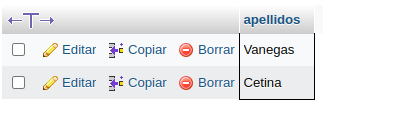

# consultas1_sql

#CONSULTAS SQL

1. Para visualizar toda la informacion que contiene la tabla `usuario` se puede incluir con la inclusion SELCET el caracter "*" o cada uno de los campos de la tabla
`select * from usuario`

2. Visualizar solamente la identificacion del usuario.

`select Identification from usuario`

3. Se desea obtener los registros cuya identidad sea mayores o iguales a 150, se utiliza la clausula where que especifica los condiciones que deben reunir los registros que se vam a seleccionar.

`SELECT * FROM usuario WHERE identification>='150'`

4. Si se desea obtener los registros cuyos sus apellido sean Vanegas o Cetina, se debe utilizar el operador IN que especifica los registros que se quieren visualizar de una tabla.

`SELECT apellidos FROM usuario WHERE apellidos IN ('Vanegas', 'Cetina')`

O se puede utilizar el operador OR

`SELECT apellidos FROM usuario WHERE apellidos ='Vanegas' OR apellidos ='Cetina'`

5. Si se desea obtener los registros cuya identificacion sea menor de '150'  y la ciudad sea 'Cali', se debe utilizar el opredaor AND.

`SELECT * FROM usuario WHERE Identificación<'150' AND ciudad_nac='Cali'`

6.Si se desea obtener los registros cuyos nombres empiecen por la letra 'A', se debe utilizar el operador LIKE que utiliza los patrones '%' todos y '_' caracter .

`SELECT * FROM usuario WHERE nombre LIKE 'A%'`

7. Si desea obtener los registros cuyos nombres que contengan la letra 'a'.

`SELECT * FROM usuario WHERE nombre LIKE '%a%'`

8. SI se desea obtener registros donde la cuarta letra sea una 'a'.

`SELECT * FROM usuario WHERE nombre LIKE '___a%'`

9. Si se desea obtener los registros cuya indentificación este entre el intervalo 110 y 150, se debe utilizar la clausula BETWEEN que sirve para especificar un intervalo de valores.

`SELECT * from usuario WHERE Identificación BETWEEN '110' AND '150'`

## COMANDO DELETE

10. Parra eliminar solamente los registros cuya identificación sea mayor de 130

`DELETE FROM usuario WHERE Identificación>130 `

11.Para actualizar la ciudad de nacimiento de Cristian Vanegas, cuya identificación es 114.

`UPDATE usuario SET ciudad_nac = 'Manizales' WHERE Identificación='114'`

## INNER JOIN 

Permite obtener datos de dos o mas tablas. Cuando se realiza la concatacion de las tablas, no necesariamente se debe mostrar todos los datos de las tablas 
# TABLA PEDIDOS

12. Para visualizar los campos identificació, nombre, apellidos de la tabla usuario y nropedido, fecha de comprar, decha de vecimiento y observación se debe realizar la siguiente instruccion SQL:

`SELECT usuario.Identificación usuario.nombre, usuario.apellidos, pedido.nropedido, pedido.fechacompra, pedido.fechavence, pedidos.observacion FROM usuario INNER JOIN Pedidos ON usuario.Identificación = pedidos.Identificación`

13. Para visualizar todos los cmapos de las tablas usuarios y pedidos donde Identificacion sea mayor que 100, se debe realizar la siguiente instruccion

`SELECT usuario.* , Pedidos.* FROM usuario INNER JOIN Pedidos ON usuario.Identificación= Pedidos.Identificacion WHERE usuario.Identificación>100;`

